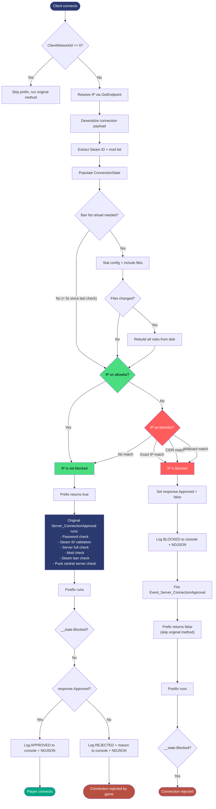

# Notes

- [Notes](#notes)
  - [Getting the Client IP](#getting-the-client-ip)
  - [The Harmony Patch](#the-harmony-patch)
  - [Ban List](#ban-list)
  - [Thread Safety](#thread-safety)
  - [Building](#building)
  - [Flow Diagram](#flow-diagram)
  - [Call Graph](#call-graph)


## Getting the Client IP

 Unity Netcode gives us a client network ID, not an IP address. The `ConnectionApprovalRequest` has the ID and a payload, but nothing about where the connection came from.

We can get it through the unity transport layer:

```csharp
UnityTransport transport =
    NetworkManager.Singleton.NetworkConfig
        .NetworkTransport as UnityTransport;

NetworkEndpoint endpoint = transport.GetEndpoint(clientId);
// endpoint.ToString() gives you "ip:port"
```

[Unity Documentation: GetEndpoint(ulong)](https://docs.unity3d.com/Packages/com.unity.netcode.gameobjects@2.10/api/Unity.Netcode.Transports.UTP.UnityTransport.html#Unity_Netcode_Transports_UTP_UnityTransport_GetEndpoint_System_UInt64_)

---

## The Harmony Patch

The mod patches `ServerManager.Server_ConnectionApproval` with a prefix and a postfix.

The **prefix** runs first. It resolves the IP, pulls the Steam ID and mod list out of the connection payload, and checks the IP against the ban list. If the IP is blocked, it sets `response.Approved = false`, logs the event, and returns `false` to skip the game's own approval logic. This avoids an unnecessary websocket conversation to puck central to validate user's steamid. Otherwise it returns `true` and lets the game handle it normally.

The **postfix** always runs, even when the prefix returns `false`. It checks a `ConnectionState` object (passed through Harmony's `__state`) to see if the prefix already handled things. If not, it reads the game's final decision from `response.Approved`, maps the rejection code to a human-readable name via `ConnectionRejectionCode.ToString()`, and logs it.

---

## Ban List

The config file (`ip_logger.banned_ip.json`) has four fields: `blocklist`, `include_files`, `allowlist`, and `allowlist_include_files`. Include files are plain text, one rule per line, `#` for comments.

Three rule types are supported:

- **Exact IP** - stored in a `HashSet<string>` 
- **CIDR** - parsed to a network/mask `uint32` pair, matched with `(ip & mask) == network`
- **Wildcard** - converted to a compiled `Regex` at load time

All IPs are parsed to `uint32` internally. In `GetBlockReason`, the IP is parsed once and reused: the `uint32` goes straight into CIDR bitwise checks, and the normalized string form is used for HashSet lookups and wildcard matching.

The allowlist is checked before the blocklist. If an IP matches any allow rule, it's never blocked.

The mod checks for config file changes on each connection, but only actually stats the files if 5+ seconds have passed since the last check. If anything changed, the full rule set is rebuilt. No background threads or polling.

---

## Thread Safety

Netcode callbacks can fire concurrently, so shared state needs protection.

**BanListLock** covers all rule collections during reload and lookup. The reload uses double-checked locking: check the cooldown outside the lock (fast path), re-check inside to prevent redundant reloads from racing threads.

**FileLock** covers the `StreamWriter` for log output.

**`volatile bool _banListLoaded`** ensures collection assignments are visible to other threads before the flag flips. It's the last assignment in the reload method for that reason.

**`Interlocked` for `long` fields** - timestamps are stored as `long` ticks because `volatile` can't be applied to `DateTime` in C#, and `long` reads aren't atomic on 32-bit .NET 4.8.

---

## Building

Clone the repository or grab [release version source code](https://github.com/PurplePlatinumVirgate/puck-ip-logger/releases)

Target is .NET Framework 4.8. Game DLLs go in `libs/` (gitignored). The `.csproj` references everything in that folder except `System.*.dll`:

```xml
<ItemGroup>
  <Libs Include="libs\*.dll" Exclude="libs\System.*.dll" />
  <Reference Include="@(Libs)">
    <HintPath>%(Libs.FullPath)</HintPath>
    <Private>false</Private>
  </Reference>
</ItemGroup>
```

`local.targets` (also gitignored) is imported for per-machine post-build steps like copying the DLL to your server's plugin directory.

```bash
dotnet build
```

For general Puck modding setup, see the [Puck Modding Guide](https://puck.gitbook.io/modding/getting-started/using-the-puck-api).

## Flow Diagram


## Call Graph

```mermaid
flowchart TD
    subgraph "Mod Lifecycle"
        OnEnable["OnEnable()"]
        OnDisable["OnDisable()"]
    end

    subgraph "Harmony Patch"
        Prefix["Prefix()"]
        Postfix["Postfix()"]
    end

    subgraph "IP Resolution"
        GetClientEndpointString["GetClientEndpointString()"]
        ExtractIp["ExtractIp()"]
    end

    subgraph "Connection Data"
        TryDeserializeConnectionData["TryDeserializeConnectionData()"]
        ExtractEnabledModIds["ExtractEnabledModIds()"]
    end

    subgraph "Ban List Loading"
        EnsureBanListLoaded["EnsureBanListLoaded()"]
        HaveAnyIncludeFilesChanged["HaveAnyIncludeFilesChanged()"]
        ReloadBanListInternal["ReloadBanListInternal()"]
        LoadBanListConfig["LoadBanListConfig()"]
        LoadRuleEntriesFromFile["LoadRuleEntriesFromFile()"]
        AddRuleEntry["AddRuleEntry()"]
        ResolveConfigRelativePath["ResolveConfigRelativePath()"]
        TrackFileTimestamp["TrackFileTimestamp()"]
    end

    subgraph "IP Matching"
        GetBlockReason["GetBlockReason()"]
        IsAllowed["IsAllowed()"]
        TryParseIpv4["TryParseIpv4()"]
        UInt32ToIpv4["UInt32ToIpv4()"]
        NormalizeIp["NormalizeIp()"]
        TryParseCidr["TryParseCidr()"]
        PrefixLengthToMask["PrefixLengthToMask()"]
    end

    subgraph "Logging & Response"
        WriteNdjsonEvent["WriteNdjsonEvent()"]
        ExtractReasonCode["ExtractReasonCode()"]
        BuildBannedReasonJson["BuildBannedReasonJson()"]
        TriggerConnectionApprovalEvent["TriggerConnectionApprovalEvent()"]
        ValueOrUnknown["ValueOrUnknown()"]
    end

    Prefix --> EnsureBanListLoaded
    Prefix --> TryDeserializeConnectionData
    Prefix --> GetClientEndpointString
    Prefix --> ExtractIp
    Prefix --> ExtractEnabledModIds
    Prefix --> GetBlockReason
    Prefix --> BuildBannedReasonJson
    Prefix --> WriteNdjsonEvent
    Prefix --> TriggerConnectionApprovalEvent
    Prefix --> ValueOrUnknown

    Postfix --> ExtractReasonCode
    Postfix --> WriteNdjsonEvent
    Postfix --> ValueOrUnknown

    EnsureBanListLoaded --> HaveAnyIncludeFilesChanged
    EnsureBanListLoaded --> ReloadBanListInternal

    ReloadBanListInternal --> LoadBanListConfig
    ReloadBanListInternal --> AddRuleEntry
    ReloadBanListInternal --> ResolveConfigRelativePath
    ReloadBanListInternal --> TrackFileTimestamp
    ReloadBanListInternal --> LoadRuleEntriesFromFile

    LoadRuleEntriesFromFile --> AddRuleEntry

    AddRuleEntry --> TryParseCidr
    AddRuleEntry --> NormalizeIp

    NormalizeIp --> TryParseIpv4
    NormalizeIp --> UInt32ToIpv4

    TryParseCidr --> TryParseIpv4
    TryParseCidr --> PrefixLengthToMask

    GetBlockReason --> TryParseIpv4
    GetBlockReason --> UInt32ToIpv4
    GetBlockReason --> IsAllowed

    IsAllowed -.-> _allowedIps["_allowedIps HashSet"]
    IsAllowed -.-> _allowedCidrs["_allowedCidrs List"]
    IsAllowed -.-> _allowedWildcards["_allowedWildcards List"]

    style OnEnable fill:#2A3A6E,color:#fff
    style OnDisable fill:#2A3A6E,color:#fff
    style Prefix fill:#00A882,color:#fff
    style Postfix fill:#00A882,color:#fff
    style GetBlockReason fill:#B85042,color:#fff
    style IsAllowed fill:#4ADE80,color:#000
```

