# Notes

- [Notes](#notes)
  - [Getting the Client IP](#getting-the-client-ip)
  - [The Harmony Patches](#the-harmony-patches)
    - [Server\_ConnectionApproval Patch](#server_connectionapproval-patch)
    - [WebSocket\_Event\_OnServerConnectionApprovalResponse Patch](#websocket_event_onserverconnectionapprovalresponse-patch)
    - [Admin Connect While Full](#admin-connect-while-full)
  - [Ban List](#ban-list)
  - [Thread Safety](#thread-safety)
  - [Building](#building)
  - [Flow Diagram](#flow-diagram)
  - [Call Graph](#call-graph)


## Getting the Client IP

 Unity Netcode gives us a client network ID, not an IP address. The `ConnectionApprovalRequest` has the ID and a payload, but nothing about where the connection came from.

We can get it through the unity transport layer:

```csharp
UnityTransport transport =
    NetworkManager.Singleton.NetworkConfig
        .NetworkTransport as UnityTransport;

NetworkEndpoint endpoint = transport.GetEndpoint(clientId);
// endpoint.ToString() gives you "ip:port"
```

[Unity Documentation: GetEndpoint(ulong)](https://docs.unity3d.com/Packages/com.unity.netcode.gameobjects@2.10/api/Unity.Netcode.Transports.UTP.UnityTransport.html#Unity_Netcode_Transports_UTP_UnityTransport_GetEndpoint_System_UInt64_)

---

## The Harmony Patches

The mod patches two game methods using Harmony prefixes and postfixes.

### Server_ConnectionApproval Patch

Patches `ServerManager.Server_ConnectionApproval` with a prefix and a postfix.

The **prefix** runs first. It resolves the IP, pulls the Steam ID and mod list out of the connection payload, and checks the IP against the ban list. If the IP is blocked, it sets `response.Approved = false`, logs the event, and returns `false` to skip the game's own approval logic. This avoids an unnecessary websocket conversation to the central server.

If the IP is not blocked, the prefix checks for the admin bypass case (see [Admin Connect While Full](#admin-connect-while-full) below). If no special handling applies, it returns `true` and lets the game handle it normally.

The **postfix** always runs, even when the prefix returns `false`. It checks a `ConnectionState` object (passed through Harmony's `__state`) to see if the prefix already handled things. If the vanilla method deferred approval to the central server (`response.Pending == true`), the postfix stores the state in `_pendingStates` keyed by Steam ID so the WebSocket patch can log the final outcome. Otherwise it reads the game's final decision from `response.Approved`, maps the rejection code to a human-readable name via `ConnectionRejectionCode.ToString()`, and logs it.

### WebSocket_Event_OnServerConnectionApprovalResponse Patch

Patches `ServerManagerController.WebSocket_Event_OnServerConnectionApprovalResponse` with a prefix and a postfix. This is the handler that runs when the game's central server responds to an identity verification request.

The **vanilla bug**: when the central server reports that a player's identity could not be verified (`success=false`), vanilla ignores this and approves the connection anyway — it only checks whether the server is full. This means a client with a forged identity will be let in as long as there's room.

The **prefix** intercepts this. On auth failure, it sets `response.Approved = false` and `response.Pending = false` before vanilla can touch the response, then returns `false` to skip vanilla entirely. This is done as a prefix rather than a postfix because vanilla sets `Approved=true` then clears `Pending` in the same call — a postfix would lose the race against Unity Netcode finalising the connection.

On auth success for normal connections, the prefix returns `true` to let vanilla handle it. On auth success for admin bypass connections (where `ConnectionState.AdminBypass` is set), the prefix approves the connection directly and returns `false` to skip vanilla's full-server check. See [Admin Connect While Full](#admin-connect-while-full).

The **postfix** removes the connection from `_pendingStates`, reads the final decision (set either by the prefix on failure/admin-bypass or by vanilla on normal success), and logs the outcome. Connections where the central server reported failure are tagged with `_LikelySpoofAttempt` in the reason. Admin bypass connections are tagged with `_AdminBypass`.

### Admin Connect While Full

On dedicated servers, admins can connect when the server is full. This was integrated from Toaster's [ToasterConnectWhileFull](https://github.com/nicholastotoreas/ToasterConnectWhileFull) mod.

The original mod approved admins immediately in a `Server_ConnectionApproval` prefix by Steam ID alone — before any identity verification. This is unsafe because the Steam ID in the connection payload is self-reported by the client. Running both mods together caused the original mod to approve forged identities before this mod's verification patch could reject them.

The integrated approach never approves an admin without verification:

1. In the `Server_ConnectionApproval` prefix, after the IP ban check passes, if the server is full and the claimed Steam ID is in `AdminSteamIds`, the mod takes over. It validates that the socket ID and Steam ID are present, checks required mods, then manually sets `response.Pending = true`, registers the response in `ConnectionApprovalRequests`, emits the WebSocket verification request, and returns `false` to skip vanilla. The `AdminBypass` flag is set on the `ConnectionState`.

2. In the `WebSocket_Event_OnServerConnectionApprovalResponse` prefix, when the central server responds with success for a connection that has `AdminBypass` set, the mod approves the connection directly — bypassing vanilla's full-server check. It also fires `Event_Server_ConnectionApproval` with `approved=true` so the game's client tracking stays consistent.

3. If the central server responds with failure for an admin bypass connection, it's rejected like any other failed verification. Someone who forged an admin's Steam ID gets caught here.

Admins bypass: server-full check, password check. Admins do **not** bypass: IP blocklist, required mods, identity verification.

---

## Ban List

The config file (`ip_logger.banned_ip.json`) has four fields: `blocklist`, `blocklist_include_files`, `allowlist`, and `allowlist_include_files`. Include files are plain text, one rule per line, `#` for comments.

Three rule types are supported:

- **Exact IP** - stored in a `HashSet<string>` 
- **CIDR** - parsed to a network/mask `uint32` pair, matched with `(ip & mask) == network`
- **Wildcard** - converted to a compiled `Regex` at load time

All IPs are parsed to `uint32` internally. In `GetBlockReason`, the IP is parsed once and reused: the `uint32` goes straight into CIDR bitwise checks, and the normalized string form is used for HashSet lookups and wildcard matching.

The allowlist is checked before the blocklist. If an IP matches any allow rule, it's never blocked.

The mod checks for config file changes on each connection, but only actually stats the files if 5+ seconds have passed since the last check. If anything changed, the full rule set is rebuilt. No background threads or polling.

---

## Thread Safety

Netcode callbacks can fire concurrently, so shared state needs protection.

**BanListLock** covers all rule collections during reload and lookup. The reload uses double-checked locking: check the cooldown outside the lock (fast path), re-check inside to prevent redundant reloads from racing threads.

**FileLock** covers the `StreamWriter` for log output.

**`_pendingStates` lock** covers the dictionary of in-flight connections waiting on WebSocket verification. Both the `Server_ConnectionApproval` postfix (writing) and the WebSocket patch (reading/removing) access this under the same lock.

**`volatile bool _banListLoaded`** ensures collection assignments are visible to other threads before the flag flips. It's the last assignment in the reload method for that reason.

**`Interlocked` for `long` fields** - timestamps are stored as `long` ticks because `volatile` can't be applied to `DateTime` in C#, and `long` reads aren't atomic on 32-bit .NET 4.8.

---

## Building

Clone the repository or grab [release version source code](https://github.com/PurplePlatinumVirgate/puck-ip-logger/releases)

Target is .NET Framework 4.8. Game DLLs go in `libs/` (gitignored). The `.csproj` references everything in that folder except `System.*.dll`:

```xml
<ItemGroup>
  <Libs Include="libs\*.dll" Exclude="libs\System.*.dll" />
  <Reference Include="@(Libs)">
    <HintPath>%(Libs.FullPath)</HintPath>
    <Private>false</Private>
  </Reference>
</ItemGroup>
```

`local.targets` (also gitignored) is imported for per-machine post-build steps like copying the DLL to your server's plugin directory.

```bash
dotnet build
```

For general Puck modding setup, see the [Puck Modding Guide](https://puck.gitbook.io/modding/getting-started/using-the-puck-api).

## Flow Diagram

```mermaid
flowchart TD
    Start([Client connects]) --> HostCheck{ClientNetworkId == 0?}
    HostCheck -- Yes --> SkipToOriginal[Skip prefix, run original method]
    HostCheck -- No --> ResolvIP[Resolve IP via GetEndpoint]

    ResolvIP --> DeserPayload[Deserialize connection payload]
    DeserPayload --> ExtractData[Extract Steam ID + mod list]
    ExtractData --> PopState[Populate ConnectionState]

    PopState --> CooldownCheck{Ban list reload needed?}
    CooldownCheck -- "No (< 5s since last check)" --> AllowCheck
    CooldownCheck -- Yes --> StatFiles[Stat config + include files]
    StatFiles --> FilesChanged{Files changed?}
    FilesChanged -- No --> AllowCheck
    FilesChanged -- Yes --> Reload[Rebuild all rules from disk]
    Reload --> AllowCheck

    AllowCheck{IP on allowlist?}
    AllowCheck -- Yes --> NotBlocked[IP is not blocked]
    AllowCheck -- No --> BlockCheck

    BlockCheck{IP on blocklist?}
    BlockCheck -- "Exact IP match" --> Blocked
    BlockCheck -- "CIDR match" --> Blocked
    BlockCheck -- "Wildcard match" --> Blocked
    BlockCheck -- No match --> NotBlocked

    Blocked[IP is blocked] --> DenyResponse["Set response.Approved = false"]
    DenyResponse --> LogBlocked[Log BLOCKED to console + NDJSON]
    LogBlocked --> FireEvent[Fire Event_Server_ConnectionApproval]
    FireEvent --> PrefixReturnFalse["Prefix returns false\n(skip original method)"]
    PrefixReturnFalse --> PostfixBlocked[Postfix runs]
    PostfixBlocked --> StateCheck{__state.Blocked?}
    StateCheck -- Yes --> Done([Connection rejected])

    NotBlocked --> AdminCheck{Dedicated server\n+ claimed admin\n+ server full?}

    AdminCheck -- Yes --> ModCheck{Required mods present?}
    ModCheck -- No --> PrefixReturnTrue
    ModCheck -- Yes --> AdminDefer["Set response.Pending = true\nRegister in ConnectionApprovalRequests\nEmit WebSocket verification request\nSet AdminBypass = true"]
    AdminDefer --> AdminFireEvent["Fire Event_Server_ConnectionApproval\n(approved=false, pending)"]
    AdminFireEvent --> AdminPrefixReturn["Prefix returns false\n(skip original method)"]
    AdminPrefixReturn --> AdminPostfix[Postfix runs]
    AdminPostfix --> AdminPending{response.Pending?}
    AdminPending -- Yes --> StoreState["Store state in _pendingStates"]
    StoreState --> WaitForWebSocket([Wait for central server response])

    WaitForWebSocket --> WSResponse{Central server response}
    WSResponse -- "success=true" --> WSAdminApprove["Set Approved=true, Pending=false\nFire Event approved=true"]
    WSResponse -- "success=false" --> WSReject["Set Approved=false, Pending=false\nReject with InvalidSteamId"]
    WSAdminApprove --> WSPostfixLog["Log APPROVED + _AdminBypass"]
    WSReject --> WSRejectLog["Log REJECTED + _LikelySpoofAttempt"]
    WSPostfixLog --> AdminConnected([Admin connects])
    WSRejectLog --> AdminRejected([Connection rejected])

    AdminCheck -- No --> PrefixReturnTrue["Prefix returns true"]
    PrefixReturnTrue --> OriginalMethod

    OriginalMethod["Original Server_ConnectionApproval runs:\n- Password check\n- Steam ID validation\n- Server full check\n- Mod check\n- Steam ban check"]

    OriginalMethod --> VanillaPending{response.Pending?\nwaiting for central server}
    VanillaPending -- No --> PostfixNormal[Postfix logs immediately]
    VanillaPending -- Yes --> PostfixStore["Postfix stores state\nin _pendingStates"]

    PostfixNormal --> ReadResponse{response.Approved?}
    ReadResponse -- Yes --> LogApproved[Log APPROVED to console + NDJSON]
    ReadResponse -- No --> LogRejected["Log REJECTED + reason to console + NDJSON"]
    LogApproved --> Connected([Player connects])
    LogRejected --> Rejected([Connection rejected by game])

    PostfixStore --> WaitWS([Wait for central server response])
    WaitWS --> WSNormal{Central server response}
    WSNormal -- "success=true" --> VanillaHandles["Vanilla approves\n(if server not full)"]
    WSNormal -- "success=false" --> WSEnforce["Mod enforces rejection\nbefore vanilla can approve"]
    VanillaHandles --> WSPostLog["Log APPROVED or REJECTED"]
    WSEnforce --> WSEnforceLog["Log REJECTED + _LikelySpoofAttempt"]
    WSPostLog --> NormalDone([Final outcome])
    WSEnforceLog --> NormalRejected([Connection rejected])

    style Start fill:#2A3A6E,color:#fff
    style Done fill:#B85042,color:#fff
    style Connected fill:#00A882,color:#fff
    style Rejected fill:#B85042,color:#fff
    style AdminConnected fill:#00A882,color:#fff
    style AdminRejected fill:#B85042,color:#fff
    style NormalDone fill:#00A882,color:#fff
    style NormalRejected fill:#B85042,color:#fff
    style Blocked fill:#FF5C5C,color:#fff
    style NotBlocked fill:#4ADE80,color:#000
    style AllowCheck fill:#4ADE80,color:#000
    style BlockCheck fill:#FF5C5C,color:#fff
    style AdminCheck fill:#4A90D9,color:#fff
    style OriginalMethod fill:#2A3A6E,color:#fff
    style AdminDefer fill:#4A90D9,color:#fff
    style WSAdminApprove fill:#00A882,color:#fff
    style WSReject fill:#B85042,color:#fff
    style WSEnforce fill:#B85042,color:#fff
```


## Call Graph

```mermaid
flowchart TD
    subgraph "Mod Lifecycle"
        OnEnable["OnEnable()"]
        OnDisable["OnDisable()"]
    end

    subgraph "ConnectionApproval Patch"
        Prefix["Prefix()"]
        Postfix["Postfix()"]
    end

    subgraph "WebSocket Patch"
        WSPrefix["WS Prefix()"]
        WSPostfix["WS Postfix()"]
    end

    subgraph "IP Resolution"
        GetClientEndpointString["GetClientEndpointString()"]
        ExtractIp["ExtractIp()"]
    end

    subgraph "Connection Data"
        TryDeserializeConnectionData["TryDeserializeConnectionData()"]
        ExtractEnabledModIds["ExtractEnabledModIds()"]
    end

    subgraph "Ban List Loading"
        EnsureBanListLoaded["EnsureBanListLoaded()"]
        HaveAnyIncludeFilesChanged["HaveAnyIncludeFilesChanged()"]
        ReloadBanListInternal["ReloadBanListInternal()"]
        LoadBanListConfig["LoadBanListConfig()"]
        LoadRuleEntriesFromFile["LoadRuleEntriesFromFile()"]
        AddRuleEntry["AddRuleEntry()"]
        ResolveConfigRelativePath["ResolveConfigRelativePath()"]
        TrackFileTimestamp["TrackFileTimestamp()"]
    end

    subgraph "IP Matching"
        GetBlockReason["GetBlockReason()"]
        IsAllowed["IsAllowed()"]
        TryParseIpv4["TryParseIpv4()"]
        UInt32ToIpv4["UInt32ToIpv4()"]
        NormalizeIp["NormalizeIp()"]
        TryParseCidr["TryParseCidr()"]
        PrefixLengthToMask["PrefixLengthToMask()"]
    end

    subgraph "Logging & Response"
        WriteNdjsonEvent["WriteNdjsonEvent()"]
        ExtractReasonCode["ExtractReasonCode()"]
        BuildBannedReasonJson["BuildBannedReasonJson()"]
        TriggerConnectionApprovalEvent["TriggerConnectionApprovalEvent()"]
        ValueOrUnknown["ValueOrUnknown()"]
    end

    subgraph "Admin Bypass"
        IsDedicatedServer["IsDedicatedServer()"]
        AdminSteamIds["ServerManager.AdminSteamIds"]
        WebSocketEmit["WebSocketManager.Emit()"]
    end

    subgraph "WebSocket Helpers"
        GetAuthResponse["GetAuthResponse()"]
        GetServerManager["GetServerManager()"]
        BuildRejectionJson["BuildRejectionJson()"]
    end

    Prefix --> EnsureBanListLoaded
    Prefix --> TryDeserializeConnectionData
    Prefix --> GetClientEndpointString
    Prefix --> ExtractIp
    Prefix --> ExtractEnabledModIds
    Prefix --> GetBlockReason
    Prefix --> BuildBannedReasonJson
    Prefix --> WriteNdjsonEvent
    Prefix --> TriggerConnectionApprovalEvent
    Prefix --> ValueOrUnknown
    Prefix --> IsDedicatedServer
    Prefix -.-> AdminSteamIds
    Prefix --> WebSocketEmit

    Postfix --> ExtractReasonCode
    Postfix --> WriteNdjsonEvent
    Postfix --> ValueOrUnknown

    WSPrefix --> GetAuthResponse
    WSPrefix --> GetServerManager
    WSPrefix --> BuildRejectionJson
    WSPrefix --> TriggerConnectionApprovalEvent
    WSPostfix --> GetAuthResponse
    WSPostfix --> ExtractReasonCode
    WSPostfix --> WriteNdjsonEvent
    WSPostfix --> ValueOrUnknown

    EnsureBanListLoaded --> HaveAnyIncludeFilesChanged
    EnsureBanListLoaded --> ReloadBanListInternal

    ReloadBanListInternal --> LoadBanListConfig
    ReloadBanListInternal --> AddRuleEntry
    ReloadBanListInternal --> ResolveConfigRelativePath
    ReloadBanListInternal --> TrackFileTimestamp
    ReloadBanListInternal --> LoadRuleEntriesFromFile

    LoadRuleEntriesFromFile --> AddRuleEntry

    AddRuleEntry --> TryParseCidr
    AddRuleEntry --> NormalizeIp

    NormalizeIp --> TryParseIpv4
    NormalizeIp --> UInt32ToIpv4

    TryParseCidr --> TryParseIpv4
    TryParseCidr --> PrefixLengthToMask

    GetBlockReason --> TryParseIpv4
    GetBlockReason --> UInt32ToIpv4
    GetBlockReason --> IsAllowed

    IsAllowed -.-> _allowedIps["_allowedIps HashSet"]
    IsAllowed -.-> _allowedCidrs["_allowedCidrs List"]
    IsAllowed -.-> _allowedWildcards["_allowedWildcards List"]

    style OnEnable fill:#2A3A6E,color:#fff
    style OnDisable fill:#2A3A6E,color:#fff
    style Prefix fill:#00A882,color:#fff
    style Postfix fill:#00A882,color:#fff
    style WSPrefix fill:#4A90D9,color:#fff
    style WSPostfix fill:#4A90D9,color:#fff
    style GetBlockReason fill:#B85042,color:#fff
    style IsAllowed fill:#4ADE80,color:#000
    style IsDedicatedServer fill:#4A90D9,color:#fff
```

